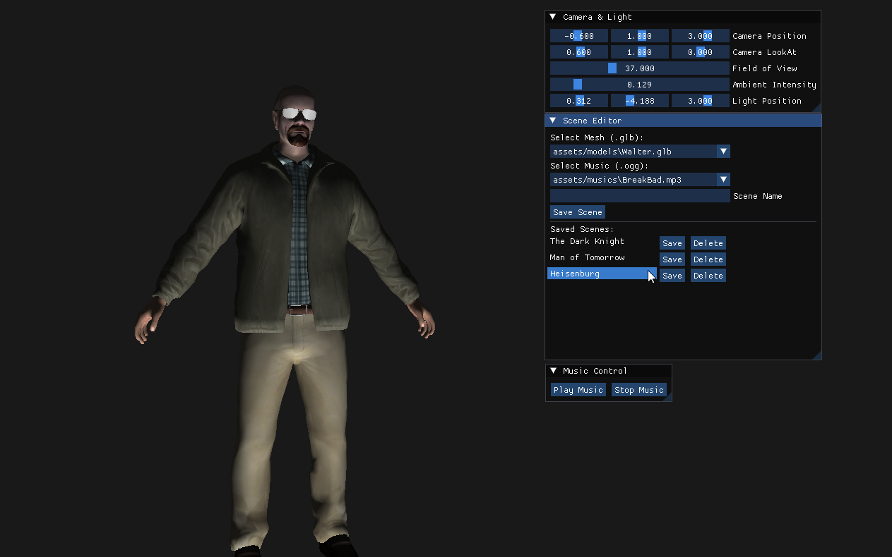

This project demonstrates a simple game engine environment featuring real-time OpenGL rendering, scene editing, and audio playback via a graphical UI using ImGui.

---

## Features

- **Scene Editor UI**  
  Edit and manage multiple 3D scenes using an intuitive ImGui-based interface.

- **Mesh & Music Selection**  
  Select `.glb` model files and `.ogg/.wav` background music for each scene.

- **Live Scene Preview**  
  View your selected model rendered in real-time with adjustable lighting and camera settings.

- **Scene Saving/Loading**  
  Save your custom scene setup to a JSON file and reload it with one click.

- **Sound System**  
  Built using [miniaudio](https://miniaud.io/) to play 2D audio tracks on demand or when switching scenes.

---

## Core Dependencies

- **OpenGL** – Real-time rendering  
- **GLFW & GLEW** – Window and context handling  
- **ImGui** – GUI for scene editing  
- **GLM** – Math library for transformations  
- **miniaudio** – Lightweight audio playback  
- **nlohmann/json** – Scene save/load in JSON format  
- **stb_image** – Optional texture handling support

---

